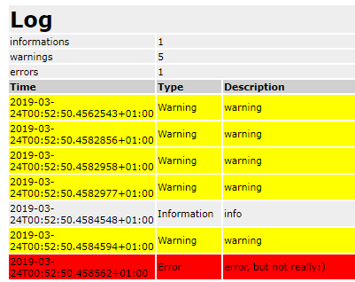

# LoggerLite [](https://choosealicense.com/licenses/mit/)

| | Integrations |
| --- | --- |
| **Nuget** | [](https://www.nuget.org/packages/LoggerLite) |
| **Build** | [](https://piotrfalkowski.visualstudio.com/LoggerLite/_build/latest?definitionId=3) |
| **Coverage** | [](https://codecov.io/gh/PFalkowski/LoggerLite) |

# Why?
Many programming tasks are reducible or somehow related to logging information. Tracing all the different implementations or handling concurency issues can be a nuisance. While there are many great, full-featured solutions, they are either not portable, bloated or hard to grasp. If you need lightweight, extensible and easy to understand logging solution, this is a library for you. Unit tests cover most of the codeline, there are no external dependencies and all relevant cade takes around 15 KB / 350 LOC. The LoggerLite is a .NET Core and .NET classic compatible solution, featuring one interface ILogger, handfull of implementations and a passive debouncer. The solution is a thin wrapper around .NET FileStreaming, XDocument, Console and other classes. Currently, the project contains following implementations:
- Console Logger
- Debug Trace Logger
- File Logger
- XML Logger
- YAML Logger
- JSON Logger
- HTML Logger

# How?
The example of console logger:
```c#
using System;
using LoggerLite;

namespace ConsoleApp1
{
    class Program
    {
        static void Main(string[] args)
        {
            var logger = new ConsoleLogger();
            logger.LogInfo("info!");
            logger.LogWarning("warning");
            logger.LogError("error :(");
            Console.ReadKey();
        }
    }
}
```


The example of yaml logger or any file logger based on FileLoggerBase:
```c#
using System;
using LoggerLite;

namespace ConsoleApp1
{
    class Program
    {
        static void Main(string[] args)
        {
            var logger = new YamlFileLogger("yamlLog.yaml");
            logger.LogInfo("info");
            logger.LogWarning("warning");
            logger.LogError("error");//no need to call save, it flushes automatically
            Console.ReadKey();
        }
    }
}
```

The example of HTML logger:
```c#
using System;
using LoggerLite;

namespace ConsoleApp1
{
    class Program
    {
        static void Main(string[] args)
        {
            var outputFile = new FileInfo(Path.ChangeExtension(Path.GetRandomFileName(), "html"));
            var logger = new HtmlLogger();
            logger.LogWarning("warning");
            logger.LogWarning("warning");
            logger.LogWarning("warning");
            logger.LogWarning("warning");
            logger.LogInfo("info");
            logger.LogWarning("warning");
            logger.LogError("error, but not really:)");
            logger.Save(outputFile);            
            using (var process = Process.Start(new ProcessStartInfo 
            { FileName = outputFile.FullName, UseShellExecute = true }))
        }
    }
}
```


Contributions are welcomed
